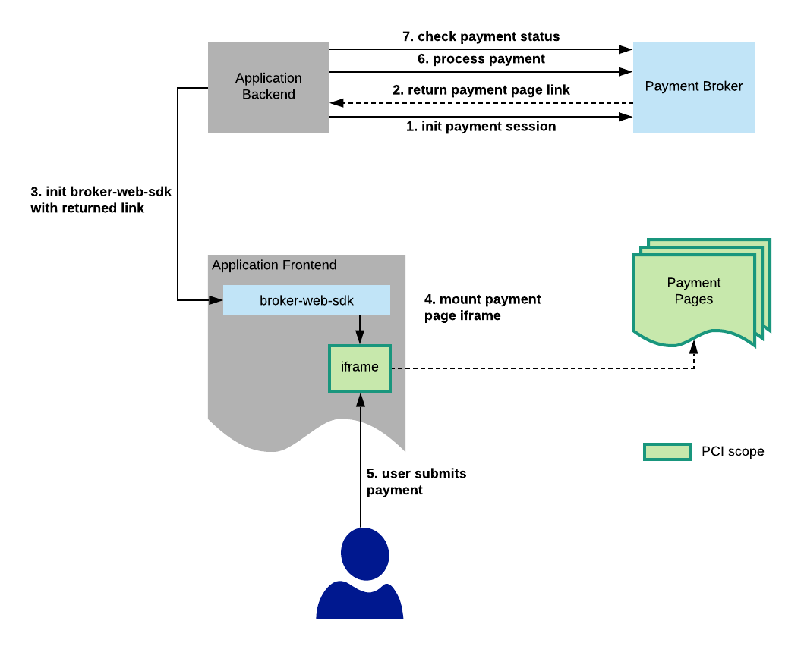
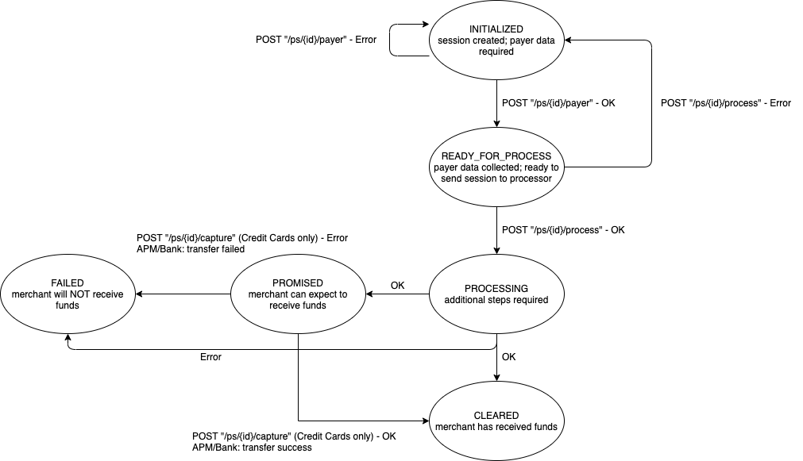

# Payment Broker User Guide
The TouchNet Payment Broker system is composed of a payment broker service, module services that handle various different payment types, a Web SDK, and the payment collection forms themselves. Together, they allow any browser-based consumer of the Broker to facilitate the collection and processing of payment data for any processor and method supported by the Broker with minimal effort on the application side. It also contains PCI scope to a small surface area that does not extend into the application's scope for compliance purposes.

Various endpoints in the Payment Broker Service return additional endpoints in the backing module services (e.g. the Credit Card Service or Alternative Payment Method (APM) Service) that contain the implementation for handling of a Payment Session. These are returned via HATEOAS links that your application can follow at runtime. 

## Getting Started
Refer to the Payment Broker OpenAPI documentation for comprehensive documentation of supported REST endpoints and their request/response parameters.

## Prerequisites
### Security
The Payment Broker services use OpenID Connect (OIDC) to authorize server-side requests. Consult your TouchNet partnership representative for support in generation of tokens for integration purposes.

### Create a Merchant
Before you can create a PaymentSession with the Broker, you need a Broker merchant to process against. For credit payments, please see your TouchNet partnership representative to establish a merchant for testing purposes in TouchNet Payment Gateway (TPG).

NOTE: It is not necessary to create a new Merchant for every `PaymentSession`. Merchant accounts are meant to be re-used.

## Integration Flow

## User Payment Submission
After you create a `PaymentSession`, the next step is to collect payer data. The Payment Broker includes its own payer data collection forms for this purpose. The response to the Create PaymentSession request includes a `redirectTo` URL. This is the page that your user must visit in order to fill out the payer collection form.

### Payment Page Options
Payment Broker supports the following options for how you want to display the payment pages for your end-users:
* Broker Web SDK: This is a JavaScript utility that enables you to embed the "raw" payer form in your page without the TouchNet branding. It uses an iframe for security/PCI reasons. If you choose to use the Broker Web SDK, you will be responsible for redirecting the user to the 3rd party payment page (if it exists). Refer to the Broker Web SDK docs for more info. See the [Broker Web SDK Guide](../README.md) for more information.
* Stand-alone: This is what you'll see if you just paste the `redirectTo` URL directly in a browser. It includes things like a header and footer with TouchNet branding. You can do a full-page redirect to this page or open it in a modal with an iframe, or you can display the page however you like. If you choose to do a full-page redirect to the `redirectTo` URL (the stand-alone option), you have transferred control to the Broker system and there will be nothing to do until either A) you observe an update from the Broker (through the GET `PaymentSession` endpoint) or B) the user returns to your app through the `returnUrl`.

## Recurring payments

These are the high-level steps used to create a merchant-initiated transaction where the card or account holder is not present:

Note that similar steps with a set up CIT session and secondary CIT session can be used to accommodate a user wallet with saved payment method tokens.

## Example App
See the Example App for testing creating a PaymentSession and use of the Broker Web SDK to collect payer data in a partner development environment. The Utility page can be used to test the Web SDK in isolation.

## PaymentSession Status Updates
At current, changes to the `PaymentSession` state must be observed via the GET PaymentSession API endpoint. There is currently a message queue based monitoring solution for updates, but it is not yet available for partners.

The PaymentSession "status" property can have any of the following values:
* INITIALIZED
* READY_FOR_PROCESS
* PROCESSING
* PROMISED
* CANCELLED
* CLEARED
* FAILED

The following diagram shows the possible PaymentSession states ("status") and when they can occur:

